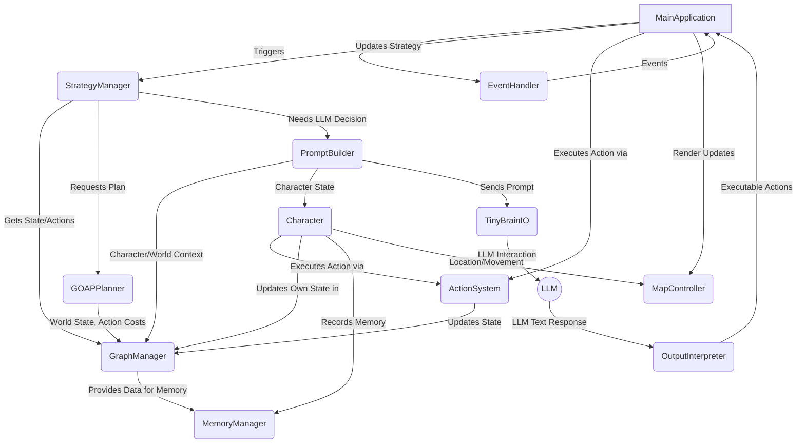

# Tiny Village - Developer Agent Guidelines

This document provides comprehensive technical guidance for AI agents working on the Tiny Village project. Follow these guidelines carefully to maintain consistency with the existing architecture and code patterns.

## Project Overview

Tiny Village is an agent-based simulation game built around a sophisticated AI architecture that combines Goal-Oriented Action Planning (GOAP), graph-based world representation, NLP-powered memory systems, and Large Language Model integration.

## Repository Structure

The Tiny Village repository is structured as follows:
tiny_village/ ├── assets/ # Game assets (images, sounds, etc.) ├── maps/ # Map files for the game world ├── design_docs/ # Design documentation ├── tests/ # Test suite ├── .github/ # GitHub configurations (workflows, etc.) ├── main.py # Main entry point for the game └── tiny_*.py # Core modules with the "tiny_" prefix

## Environment Setup
Set up the following environment variables for optimal performance:
```bash
# For TinyLlama cache paths
export TRANSFORMERS_CACHE=/path/to/cache
# For pygame window settings (optional)
export PYGAME_DISPLAY_WIDTH=1024
export PYGAME_DISPLAY_HEIGHT=768
```

NOTE TO AGENT: The requirements in requirements.txt are extensive and take up a lot of VM storage space. For this reason, please avoid: a) installing all requirements b) performing testing that may fail due to uninstalled modules (instead, attempt simple unit tests where possible; however BE CAREFUL AND CONSERVATIVE about creating fake or mock classes as this may not correctly test the functions. 

Also, be cautious in test design, only design tests to accurately test functions, do NOT design tests meant to pass even if the function isn't doing exactly what it should do! In other words, dont design tests to pass, design tests that will only pass if the tested code works as intended and fail otherwise.

## Technical Architecture

### Architecture Overview
Tiny Village follows a modular architecture with the following key principles:

   - Each component is prefixed with tiny_
   - Separation of concerns between game logic, rendering, and AI components
   - Event-driven communication between modules
   - Singleton pattern for global state management

The system follows a modular architecture with these key components:

### Core Components

1. **MainApplication** (`main.py`, `tiny_gameplay_controller.py`)
   - Initializes all systems
   - Runs the main game loop
   - Manages game time
   - Interfaces with: `EventHandler`, `StrategyManager`, `GraphManager`, `MapController`

2. **EventHandler** (`tiny_event_handler.py`)
   - Detects and queues game events
   - Interfaces with: `MainApplication`, `GraphManager`

3. **StrategyManager** (`tiny_strategy_manager.py`)
   - Orchestrates high-level decision-making for characters
   - Interfaces with: `MainApplication`, `GraphManager`, `GOAPPlanner`, `PromptBuilder`

4. **GraphManager** (`tiny_graph_manager.py`)
   - Central repository of game world state using `networkx.MultiDiGraph`
   - Calculates derived data (motives, relationship strengths)
   - Interfaces with: Nearly all other modules

5. **Character** (`tiny_characters.py`)
   - Represents individual AI agents with personal state
   - Makes decisions through GOAP and LLM processes
   - Interfaces with: `GraphManager`, `ActionSystem`, `MemoryManager`, `GOAPPlanner`, `PromptBuilder`

6. **ActionSystem** (`actions.py`)
   - Defines rules for actions (preconditions, effects, costs)
   - Interfaces with: `Character` objects, `GOAPPlanner`, `GraphManager`

7. **GOAPPlanner** (`tiny_goap_system.py`)
   - Generates sequences of actions (plans) to achieve character goals
   - Interfaces with: `StrategyManager`, `GraphManager`, `Character`, `ActionSystem`

8. **LLM_Interface** (Conceptual component spanning multiple files)
   - `PromptBuilder`: Constructs text prompts for the LLM
   - `TinyBrainIO`: Handles communication with the LLM
   - `OutputInterpreter`: Parses LLM responses into game actions
   - Interfaces with: `Character`, `GraphManager`, LLM service

9. **MemoryManager** (`tiny_memories.py`)
   - Manages character memories with NLP processing and retrieval
   - Interfaces with: `Character`, `GraphManager`

10. **MapController** (`tiny_map_controller.py`)
    - Manages visual representation and map-based interactions
    - Interfaces with: `MainApplication`, `Character`

### Class Structure

#### Action System (`actions.py`)

```python
class State:
    # Represents the current state of game entities
    # Methods:
    # - compare_to_condition(): Checks if a state attribute meets a condition

class Condition:
    # Defines criteria for actions (preconditions) or goal states
    # Attributes: name, attribute, target, satisfy_value, op, weight
    # Methods:
    # - check_condition(state): Evaluates the condition

class Action:
    # Represents a single, executable game action
    # Attributes: name, preconditions, effects, cost, target, initiator, related_skills, impact_ratings
    # Methods:
    # - preconditions_met(): Checks if all preconditions are satisfied
    # - apply_effects(): Modifies a State based on defined effects
    # - execute(): Main execution logic with GraphManager integration

class ActionTemplate:
    # Blueprint for creating actions
    # Used by ActionGenerator to instantiate specific actions

class ActionGenerator:
    # Creates Action instances from templates
    # Supports extensibility in the action system

class Skill, JobSkill, ActionSkill:
    # Represent character capabilities

class ActionSystem:
    # Manages action definitions and execution
    # Methods:
    # - setup_actions(): Defines templates
    # - generate_actions(): Creates action instances
    # - execute_action(): Used by GOAP for simulation
```

#### GOAP System (`tiny_goap_system.py`)

```python
class Plan:
    # Represents a sequence of actions to achieve goals
    # Attributes: name, goals, action_queue, completed_actions
    # Methods:
    # - add_goal(), add_action(), execute(), replan()

class GOAPPlanner:
    # Core Goal-Oriented Action Planning engine
    # Methods:
    # - goap_planner(character, goal, char_state, actions): Main planning algorithm
    # - evaluate_goal_importance(character, goal, graph_manager): Assesses goal relevance
    # - calculate_goal_difficulty(character, goal): Delegates to GraphManager
```

#### Memory System (`tiny_memories.py`)

```python
class Memory:  # Base class
    # Basic attributes: description, creation_time, last_access_time

class GeneralMemory(Memory):
    # Represents broader memory categories
    # Attributes: embedding, FAISS index, MemoryBST instances
    # Methods: add_specific_memory(), other memory management functions

class SpecificMemory(Memory):
    # Represents individual experiences
    # Attributes: parent_memory, embedding, keywords, tags, importance_score,
    #             sentiment_score, emotion_classification, facts
    # Methods: analyze_description() - NLP analysis

class MemoryBST:
    # Balanced AVL tree for organizing SpecificMemory objects
    # Enables efficient O(log n) lookups by timestamp, importance, etc.

class EmbeddingModel:
    # Generates sentence embeddings using models like "all-mpnet-base-v2"

class SentimentAnalysis:
    # Performs sentiment and emotion analysis

class FlatMemoryAccess:
    # Provides global search across all SpecificMemory instances
    # Manages global FAISS index

class MemoryQuery:
    # Encapsulates a search query for the memory system
    # Attributes: query text, embedding, tags, filter criteria

class MemoryManager:
    # Orchestrates the entire memory system
    # Methods:
    # - analyze_query_context(): Core NLP pipeline
    # - retrieve_memories(): Main search entry point
    # - extract_keywords(), extract_facts(), etc.
```

### GraphManager Details

The `GraphManager` uses a `networkx.MultiDiGraph` to model the game world with these key elements:

#### Node Types & Attributes

1. **Character**
   - `name`, `age`, `job`, `happiness`, `energy_level`, `wealth_money`, `health_status`, 
   - `hunger_level`, `mental_health`, `social_wellbeing`, `shelter`, `coordinates_location`, 
   - `inventory`, `personality_traits`, `skills`, `goals`, `current_action`

2. **Location**
   - `name`, `popularity`, `activities_available`, `accessible`, `security`, 
   - `coordinates_location`, `threat_level`, `visit_count`

3. **Event**
   - `name`, `event_type`, `date`, `importance`, `impact`, `required_items`, `coordinates_location`

4. **Object (Item)**
   - `name`, `item_type`, `value`, `usability`, `coordinates_location`, `ownership_history`

5. **Activity**
   - `name`, `related_skills`, `required_items`, `preconditions`, `effects`

6. **Job**
   - `name`, `job_title`, `required_skills`, `location`, `salary`, `available`

#### Edge Types & Attributes

1. **Character-Character**
   - `relationship_type` (friend, family), `strength`, `historical`, `emotional_impact`,
   - `trust`, `interaction_frequency`, `romance_compatibility`

2. **Character-Location**
   - `frequency_of_visits`, `last_visit`, `favorite_activities`, `ownership_status`

3. **Character-Item**
   - `ownership_type`, `sentiment_value`, `usage_frequency`

## Data Flow: Character Decision Cycle

The decision flow for characters follows this sequence:

1. **Event Trigger** (`EventHandler` → `MainApplication`)
2. **Strategy Initiation** (`MainApplication` → `StrategyManager.update_strategy()`)
3. **Character State & Context Gathering** (`StrategyManager` → `GraphManager.get_character_state()`)
4. **Goal Evaluation & Prioritization** (`StrategyManager`/`Character` → `GOAPPlanner.evaluate_goal_importance()`)
5. **Action Planning** (`StrategyManager` → `GOAPPlanner.goap_planner()`)
6. **Prompt Generation for LLM** (`StrategyManager`/`Character` → `PromptBuilder.generate_daily_routine_prompt()`)
7. **LLM Interaction** (`TinyBrainIO` → LLM)
8. **Output Interpretation** (LLM response → `OutputInterpreter` → `Action` objects)
9. **Action Execution** (`GameplayController` → `Action.execute()` → `GraphManager` updates)
10. **Memory Update** (`Character` → `MemoryManager.add_memory()`)


## Global State & Time Management
### Global State
The `tiny_globals.py` module provides a centralized way to manage global state:

```python
from tiny_globals import set_global, get_global

# Setting a global variable
set_global("player_name", "Villager1")

# Getting a global variable
player_name = get_global("player_name")
```

Important globals include:

   - `global_time_manager`: The main time manager instance
   - `global_game_state`: The current state of the game
   - `global_event_bus`: The event communication system

### Time Management
Game time is managed through the tiny_time_manager.py module:
```python
from tiny_time_manager import GameTimeManager

# Get the global time manager
time_manager = get_global("global_time_manager")

# Or create your own instance
custom_time_manager = GameTimeManager()
```

Time advances through the tick system in the main game loop:

```python
# In the main game loop
time_manager.tick(delta_time)
```
When to use global vs. local time manager:

   - Use the global time manager for game-wide time events
   - Use a local time manager when you need isolated time tracking
   - Always pass your time manager explicitly to functions that need it

## LLM Prompt Conventions

### Prompt Templates
Prompt templates are stored in tiny_brain_io.py and follow these naming conventions:

   - `SYSTEM_PROMPT_*`: For system instructions to the LLM
   - `USER_PROMPT_*`: For user queries to the LLM
   - `CONTEXT_*`: For providing game context information

### Character/Context Injection

When creating prompts for NPCs or game events, ensure you always include:

   - Character name and role
   - Character's personality traits
   - Current game time and location
   - Relevant game state information
   - History of recent interactions
Example:
```python
prompt = SYSTEM_PROMPT_NPC.format(
    character_name=npc.name,
    character_role=npc.role,
    personality=npc.personality,
    current_time=time_manager.get_formatted_time(),
    current_location=npc.location.name
)
```


## Coding Conventions

### Naming Standards

1. **Classes:** PascalCase
   ```python
   class CharacterEntity:
       pass
   ```

2. **Methods & Variables:** snake_case
   ```python
   def calculate_path_to_target(self, target_location):
       distance_to_target = self.calculate_distance(self.location, target_location)
   ```

3. **Constants:** UPPER_SNAKE_CASE
   ```python
   MAX_INVENTORY_SLOTS = 20
   DEFAULT_HUNGER_RATE = 0.05
   ```

4. **Private Methods/Attributes:** Single leading underscore
   ```python
   def _internal_state_update(self):
       self._last_update_time = time.time()
   ```

### File Organization

1. Each component should be in its designated file:
   - Character logic in `tiny_characters.py`
   - Actions in `actions.py`
   - Memory system in `tiny_memories.py`

2. Maintain logical separation of concerns:
   - State representation (GraphManager)
   - Decision logic (GOAPPlanner, StrategyManager)
   - Action execution (ActionSystem)
   - Memory (MemoryManager)

### Documentation Requirements

1. **Class Documentation:**
   ```python
   class Character:
       """
       Represents a villager in the simulation.
       
       Manages the character's state, decision-making, and interactions
       with the world through the GraphManager and ActionSystem.
       
       Attributes:
           name (str): The character's name
           age (int): The character's age in years
           job (Job): Reference to the character's current job
       """
   ```

2. **Method Documentation:**
   ```python
   def evaluate_goal_importance(self, character, goal, graph_manager, **kwargs):
       """
       Determines how important a goal is to a character based on
       their current state and motives.
       
       Args:
           character (Character): The character evaluating the goal
           goal (Goal): The goal being evaluated
           graph_manager (GraphManager): The world state manager
           **kwargs: Additional parameters for goal evaluation
           
       Returns:
           float: Importance score between 0.0 and 1.0
           
       Raises:
           ValueError: If the goal type is not recognized
       """
   ```

## Development Workflow

### Adding New Features

1. **Adding a New Character Behavior:**
   - Add new behavior class in `src/systems/ai/behaviors/`
   - Implement required methods:
     ```python
     class GatherResourceBehavior:
         def can_execute(self, character, world_state):
             """Check if character can perform this behavior"""
             return (
                 character.energy_level > MIN_ENERGY and
                 world_state.has_resource_nodes_nearby(character.position)
             )
             
         def execute(self, character, world_state):
             """Execute the behavior"""
             resource_node = world_state.get_nearest_resource(character.position)
             return ActionSequence([
                 MoveToAction(target=resource_node),
                 GatherResourceAction(source=resource_node)
             ])
     ```
   - Register the behavior in the appropriate behavior registry

2. **Adding a New Action:**
   - Create a new Action class in `actions.py`
   - Define preconditions and effects
     ```python
     class BuildShelterAction(Action):
         def __init__(self, target_location, initiator):
             super().__init__(
                 name="build_shelter",
                 preconditions={
                     "has_resources": Condition("has_resources", "inventory", initiator, {"wood": 5, "stone": 3}, ">="),
                     "at_location": Condition("at_location", "coordinates_location", initiator, target_location, "==")
                 },
                 effects=[
                     {"attribute": "shelter", "target": initiator, "value": True, "operation": "="},
                     {"attribute": "inventory", "target": initiator, "value": {"wood": -5, "stone": -3}, "operation": "+="}
                 ],
                 cost=15,  # Energy cost
                 target=target_location,
                 initiator=initiator
             )
     ```
   - Register the action in `ActionSystem.setup_actions()`

3. **Adding New Memory Types:**
   - Define new memory class extending `Memory` or `SpecificMemory`
   - Implement specific methods for processing and retrieval
   - Update `MemoryManager` to handle the new memory type

### Testing Requirements
When writing tests, do **NOT** over-mock or fake classes if avoidable. Write tests so that they will fail if the function does not work as expected, do NOT design tests so that they will pass regardless! Good tests fail when there is an error, **NEVER manipulate the test design to make it pass while the tested function does not function as expected!**

The requirements in requirements.txt are extensive and take up a lot of VM storage space. For this reason, please avoid: a) installing all requirements b) performing testing that may fail due to uninstalled modules (instead, attempt simple unit tests where possible; however BE CAREFUL AND CONSERVATIVE about creating fake or mock classes as this may not correctly test the functions.

Also, be cautious in test design, only design tests to accurately test functions, **do NOT design tests meant to pass even if the function isn't doing exactly what it should do!** In other words, don't design tests to pass, design tests that will only pass if the tested code works as intended and fail otherwise.
1. **Unit Testing:**
   - Test each component in isolation
   - Mock dependencies for focused testing
   - Example:
     ```python
     def test_goap_planner_finds_valid_path():
         # Arrange
         character = create_test_character()
         goal = Goal("has_food", {"hunger_level": 0})
         actions = [MoveToAction, GatherFoodAction, EatFoodAction]
         
         # Act
         plan = GOAPPlanner.goap_planner(character, goal, character.get_state(), actions)
         
         # Assert
         assert len(plan.action_queue) > 0
         assert plan.action_queue[-1].name == "eat_food"
     ```

2. **Integration Testing:**
   - Test components working together
   - Focus on data flow between components

## Pull Request Guidelines

All PRs must follow this format:

```markdown
## Description
[Detailed description of the changes]

## Technical Implementation
- [Specific implementation details]
- [Design patterns used]
- [Algorithms implemented]

## Related Issues
Closes #[issue number]

## Testing
- [Unit tests added/modified]
- [Integration tests performed]
- [Edge cases considered]

## Performance Considerations
- [Time complexity analysis if relevant]
- [Memory usage considerations]
- [Optimization strategies used]
```

## Code Quality Checks

Before submitting any changes:

1. Run unit tests:
   ```bash
   python -m unittest discover tests
   ```

2. Verify code follows architecture patterns:
   - Actions properly defined with preconditions/effects
   - Memory objects properly structured for NLP processing
   - Graph updates correctly implemented
   - Decision logic follows GOAP principles

3. Check for memory leaks and performance bottlenecks:
   - Profile memory-intensive operations
   - Ensure proper cleanup of resources

## Architecture Diagrams

Refer to the `design_docs` folder for detailed architecture diagrams (Mermaid format):

### Component Interaction



By following these guidelines, you'll help maintain the architectural integrity and code quality of Tiny Village while ensuring your contributions integrate seamlessly with the existing systems.
