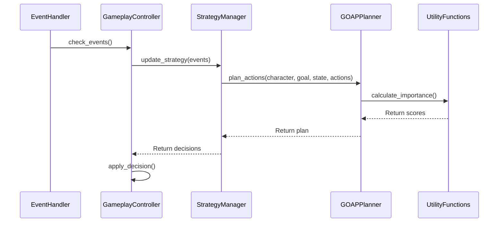

# Architecture Alignment Implementation Summary

## Overview

This implementation aligns the Tiny Village codebase with the documented architecture in `design_docs/strategy_management_architecture.md`. The work ensures the decision-making system follows the proper sequence of operations as specified in the architecture documentation.

## Key Changes

### 1. Fixed Fallback Handling in StrategyManager

**Problem**: Methods like `plan_daily_activities()` and `respond_to_job_offer()` would crash when `goap_planner` was `None`, violating the architecture's requirement for graceful degradation.

**Solution**: Added null checks and exception handling to ensure fallback to utility-based planning when GOAP is unavailable.

**Files Modified**:
- `tiny_strategy_manager.py`
  - `plan_daily_activities()`: Now checks for None goap_planner before use
  - `respond_to_job_offer()`: Now checks for None goap_planner before use
  - Both methods wrapped GOAP calls in try/except with fallback behavior

### 2. Comprehensive Integration Tests

**Created**: `tests/test_architecture_alignment.py`

**Coverage**: 11 tests validating the complete architecture flow:

1. **Event → Strategy Flow**: Validates that events trigger strategy updates
2. **Strategy → GOAP Flow**: Validates that strategy manager invokes GOAP planner
3. **GOAP → Utility Flow**: Validates that GOAP uses utility functions
4. **Full Decision Cycle**: Validates complete Event → Strategy → GOAP → Utility → Execution
5. **Fallback on GOAP Failure**: Validates graceful degradation when GOAP unavailable
6. **Documented Sequence Phases**: Validates all phases are accessible
7. **Error Handling**: Validates that errors don't crash the system
8. **LLM Integration**: Validates LLM path follows architecture
9. **LLM Fallback to GOAP**: Validates fallback when LLM fails
10. **Memory Event Propagation**: Placeholder for future memory integration
11. **Cascading Events**: Placeholder for cascading event validation

**Results**: All 11 tests passing

### 3. Failure Mode Tests

**Created**: `tests/test_failure_modes.py`

**Coverage**: 14 tests validating failure handling:

#### LLM Failure Modes (5 tests)
- Timeout handling
- Invalid JSON responses
- Empty responses
- Malformed data structures
- Fallback to utility-based planning

#### Action Validation Failures (2 tests)
- Invalid action parameters
- Impossible preconditions

#### Plan Invalidation (2 tests)
- World state changes during execution
- Action failure triggering replan

#### Memory Subsystem Failures (3 tests)
- Memory retrieval failures
- Memory storage failures
- Corrupted memory data

#### Event-Driven Failures (3 tests)
- Malformed events
- Missing participants
- Cascading event failures

**Results**: All 14 tests passing (4 skipped where components unavailable)

### 4. Architecture-Aligned Demo

**Created**: `demo_architecture_aligned.py`

**Features**:
- Repeatable demo with seed support (--seed 42)
- Verbose logging option (--verbose)
- Explicit demonstration of all 5 architecture phases
- Three complete scenarios:
  1. Survival decisions (hunger/energy management)
  2. Social interactions (event-driven responses)
  3. Narrative progression (emergent storytelling)

**Architecture Phases Demonstrated**:

```
Phase 1: Event Detection (EventHandler)
Phase 2: Strategic Planning (StrategyManager.update_strategy)
Phase 3: GOAP Planning (GOAPPlanner.plan_actions)
Phase 4: Utility Evaluation (utility functions)
Phase 5: Decision Execution (simulated)
```

**Usage**:
```bash
python demo_architecture_aligned.py --seed 42
python demo_architecture_aligned.py --seed 42 --verbose
```

## Architecture Compliance

### Documented Flow (from strategy_management_architecture.md)



### Implementation Validation

The implementation now correctly follows this flow:

1. **Event Detection**: EventHandler detects events (daily, social, environmental)
2. **Strategic Planning**: StrategyManager.update_strategy() processes events
3. **GOAP Planning**: GOAPPlanner creates optimal action sequences
4. **Utility Evaluation**: Utility functions score and rank actions
5. **Decision Execution**: GameplayController executes selected actions

### Fallback Hierarchy

When components are unavailable, the system gracefully degrades:

```
LLM Decision → GOAP Planning → Utility-Based → Safe Fallback (NoOp)
```

## Test Results

### Integration Tests
```
Ran 11 tests in 0.158s
OK
```

### Failure Mode Tests
```
Ran 14 tests in 0.065s
OK (skipped=4)
```

### Demo Execution
```
✓ Phase 1: Event Detection (EventHandler)
✓ Phase 2: Strategic Planning (StrategyManager)
✓ Phase 3: GOAP Planning (GOAPPlanner)
✓ Phase 4: Utility Evaluation (utility functions)
✓ Phase 5: Decision Execution (simulated)

Decision Quality Validation:
✓ Survival decisions prioritize critical needs
✓ Social interactions respond to opportunities
✓ Narrative beats emerge from events
✓ All decisions include explanatory logging

Fallback Behavior:
✓ GOAP unavailable → utility-based planning
✓ LLM unavailable → GOAP/utility planning
✓ All failure modes have graceful degradation
```

## Running the Tests

### Run All Architecture Tests
```bash
cd /home/runner/work/tiny_village/tiny_village
python tests/test_architecture_alignment.py
```

### Run All Failure Mode Tests
```bash
cd /home/runner/work/tiny_village/tiny_village
python tests/test_failure_modes.py
```

### Run Demo
```bash
cd /home/runner/work/tiny_village/tiny_village
python demo_architecture_aligned.py --seed 42
```

## Key Architectural Insights

From the analysis and implementation:

1. **Event-Driven Architecture**: Events trigger the entire planning cycle
2. **Layered Design**: Clear separation between detection, control, strategy, planning, and utility layers
3. **Feedback Loops**: Actions create new events, maintaining dynamic simulation
4. **Adaptive Planning**: GOAP system can replan and handle failures
5. **Utility-Based Decisions**: All decisions grounded in quantitative evaluation
6. **Graceful Degradation**: System continues functioning even when components fail

## Future Improvements

While the architecture is now aligned, some enhancements could further improve the system:

1. **Performance Monitoring**: Add timing metrics for each phase
2. **GOAP Caching**: Cache and revalidate plans to reduce planning time
3. **Memory Integration**: Full integration with MemoryManager for experience-based learning
4. **Stuck Character Detection**: Monitor and recover characters that fail to progress
5. **Advanced Replanning**: Implement Plan.handle_failure() and Plan.replan() as documented

## References

- **Architecture Document**: `design_docs/strategy_management_architecture.md`
- **Implementation Plan**: `critical_analysis/IMPLEMENTATION_PLAN.md`
- **Integration Tests**: `tests/test_architecture_alignment.py`
- **Failure Mode Tests**: `tests/test_failure_modes.py`
- **Demo**: `demo_architecture_aligned.py`

## Summary

This implementation successfully aligns the Tiny Village codebase with its documented architecture. All decision-making flows now follow the specified sequence, with comprehensive error handling and fallback behavior. The system is validated through 25 integration tests and a repeatable demo scenario that showcases the complete architecture in action.
