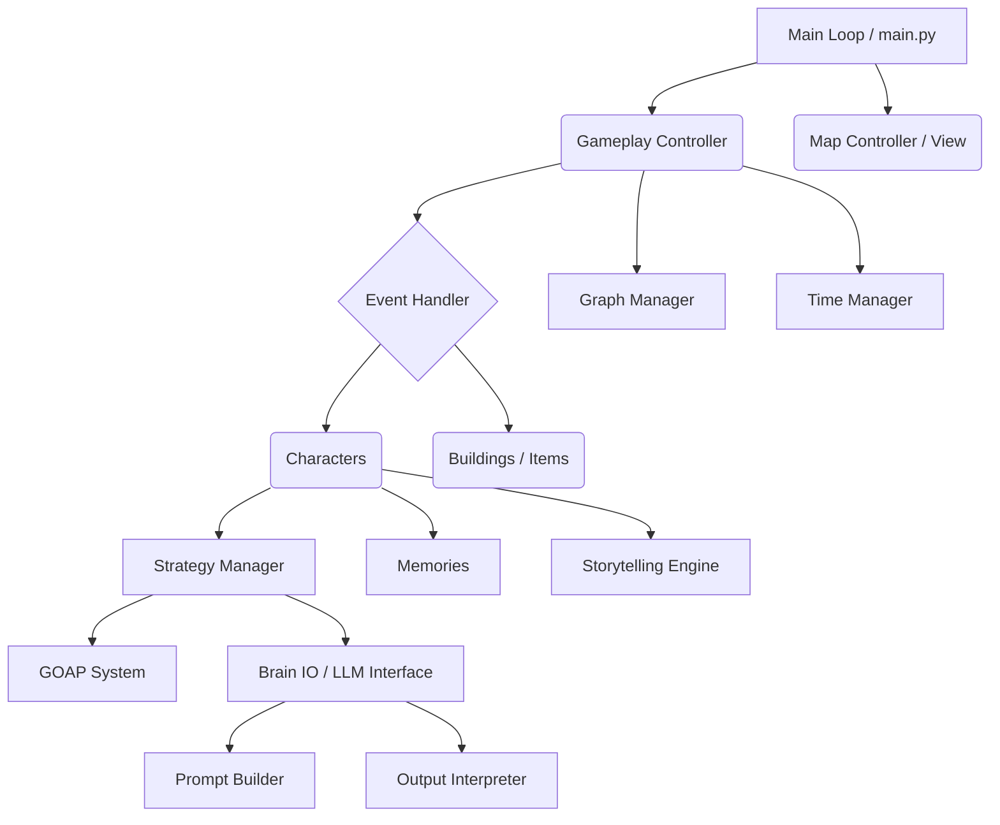

# Comprehensive Architecture Blueprint: TinyVillage

## 1. Architectural Overview
TinyVillage is a complex, monolithic Python application built around a real-time 2D simulation engine. Its primary distinguishing feature is the hybrid intelligence model, which marries deterministic AI systems (Goal-Oriented Action Planning - GOAP) with non-deterministic Local Large Language Models (LLMs) to create autonomous, believable village inhabitants. The architecture follows an Event-Driven Simulation Loop pattern.

## 2. Architecture Visualization

## 3. Core Architectural Components

- **Simulation Controllers**
  - `tiny_gameplay_controller.py`: The heart of the simulation loop. Manages ticks, entity updates, and orchestrates state changes.
  - `tiny_map_controller.py`: Handles spatial rendering, the visual map, and minimap logic.

- **Hybrid Intelligence Layer**
  - `tiny_goap_system.py`: Deterministic planning system defining state preconditions and effects.
  - `tiny_strategy_manager.py`: High-level goal setting and strategy orchestration.
  - `tiny_brain_io.py` & `tiny_prompt_builder.py`: Manages I/O with the local LLM (TinyLlama). Translates game state into context-rich prompts.
  - `tiny_output_interpreter.py`: Parses unstructured LLM text into actionable JSON/commands.

- **Entity & World Management**
  - `tiny_characters.py`, `tiny_buildings.py`, `tiny_items.py`, `tiny_jobs.py`: Domain models representing the physical and social entities.
  - `tiny_graph_manager.py`: Manages the global graph connecting characters, locations, items, and relationships.

- **Memory & Narrative Systems**
  - `tiny_memories.py` / `tiny_memories_alpha.py`: Stores character experiences, using embeddings/FAISS for semantic retrieval.
  - `tiny_storytelling_engine.py` & `tiny_story_arc.py`: Generates emergent narrative arcs based on recent events.

- **Infrastructure Core**
  - `tiny_event_handler.py`: Centralized event bus for dispatching actions and state changes.
  - `tiny_time_manager.py`: Controls in-game time progression and scheduling.

## 4. Architectural Layers and Dependencies

1. **Presentation Layer**: Visual rendering (PyGame), CLI output modes.
2. **Simulation Control Layer**: Game loop, ticking mechanisms, and event routing.
3. **Domain Entity Layer**: Core objects (Characters, Buildings, Items) containing their local state.
4. **Intelligence Layer**: The "Brains" - GOAP planners, prompt builders, LLM interactions.
5. **Data/State Layer**: Memory databases (Pickle/JSON), Global Graph (`tiny_graph_manager.py`).

## 5. Data Architecture

- **In-Memory State**: The live game state resides primarily in Python objects during execution.
- **Persistence Mechanism**: 
  - `flat_access_memories.pkl`: Serialized memory states.
  - `user_preferences.json`, `custom_buildings.json`, `custom_characters.json`: Configuration and initial state seeding.
- **Vector Search / RAG**: The system uses FAISS and local embeddings (`l2.bin`, `ip_norm.bin`) for semantic memory retrieval.
- **Graph Representation**: Graph structures manage complex relationships between actors and locations.

## 6. Cross-Cutting Concerns Implementation

- **Event Dispatch**: Handled entirely by `tiny_event_handler.py` and `effect_dispatcher.py`, decoupling component actions from state mutations.
- **Error Handling**: Structured fallback logic ensures that if the LLM generation fails or produces invalid JSON, the system gracefully defaults to deterministic GOAP routines.
- **Time Management**: Standardized via `tiny_time_manager.py` to decouple real-world compute time from simulation time.

## 7. Service Communication Patterns

- **Pub/Sub Eventing**: Components emit events to the Event Handler.
- **Synchronous Method Calls**: Within the tick update loop, objects call dependencies synchronously.
- **Asynchronous/External LLM Calls**: Interactions with the local Llama model run as text-in/text-out inferences.

## 8. Testing Architecture

- **Integration Testing**: Extensive integration tests (`test_integration.py`, `test_system_integration.py`, `test_map_interactivity.py`) verifying the monolithic simulation loop end-to-end.
- **Anti-Pattern Prevention**: Test suites deliberately avoid excessive Mocking to ensure real logic is validated, especially when dealing with AI prompt outputs.

## 9. Deployment Architecture

- **Local Execution**: Designed to run natively on the user's hardware (`python main.py`).
- **Dependencies**: Relies heavily on Python 3.8+, requiring standard packages (`requirements.txt`), PyGame for rendering, and potentially FAISS for vector search.

## 10. Extension and Evolution Patterns

- **Data-Driven Extensibility**: Adding new content (jobs, buildings, names) is done via JSON files and flat text files.
- **Schema Upgrades**: The system utilizes evolving schemas for how actions affect world state.
- **Agentic Workflows**: Integrated `AGENTS.md` and `memory-bank` instructions for seamless AI-assisted development.