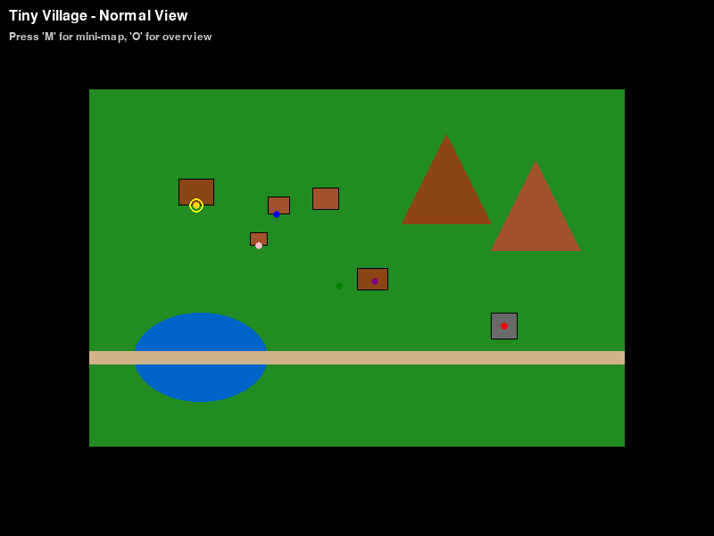
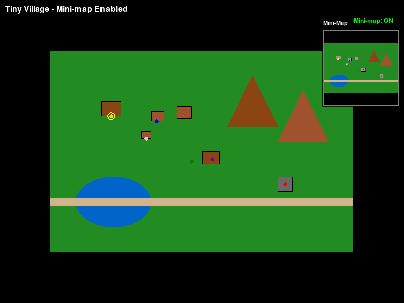
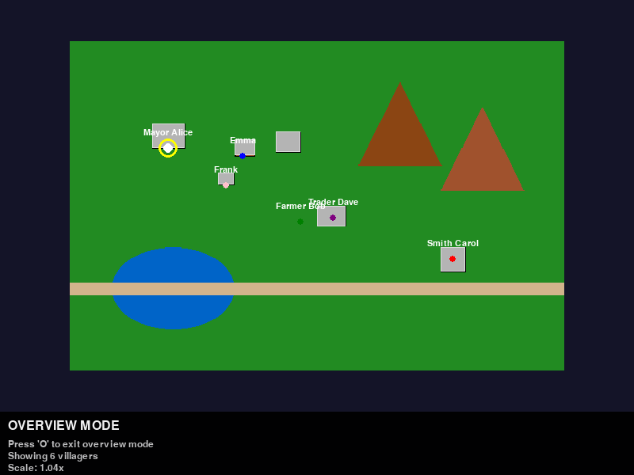

# Mini-map and Overview Mode Features

This document describes the newly implemented mini-map and overview mode features in Tiny Village.

## Features Implemented

### Mini-map Mode
- **Activation**: Press 'M' key to toggle mini-map on/off
- **Location**: Displays in the top-right corner of the screen
- **Size**: 200x200 pixel mini-map with scaled content
- **Content**: Shows scaled version of the game world including:
  - Buildings as gray rectangles
  - Characters as colored dots
  - Selected character highlighted in yellow
  - Semi-transparent background with border

### Overview Mode  
- **Activation**: Press 'O' key to toggle overview mode on/off
- **Display**: Full-screen overview of the entire game world
- **Features**:
  - Scaled map to fit screen with UI space reserved at bottom
  - Buildings shown with enhanced visibility (gray with white borders)
  - Characters displayed as larger dots with names
  - Selected character highlighted with yellow ring
  - UI overlay showing instructions and statistics
  - Dark background for better contrast

## Key Bindings
- **M**: Toggle mini-map mode
- **O**: Toggle overview mode
- Both modes can be active independently

## Implementation Details

### Code Changes
- Added toggle state variables: `_minimap_mode` and `_overview_mode`
- Added key bindings for 'M' and 'O' keys
- Created `_render_minimap()` method for mini-map rendering
- Created `_render_overview()` method for overview mode rendering
- Modified main `render()` method to handle overview mode
- Updated `_render_ui()` to include mini-map when enabled
- Added status indicators and help text

### Technical Features
- Proper aspect ratio preservation when scaling
- Error handling for missing map data
- Performance-optimized rendering
- Configurable positioning and sizing
- Semi-transparent overlays for better visibility

## Screenshots

### Normal Game View

*Standard game view showing the village with characters and buildings*

### Mini-map Enabled

*Game view with mini-map overlay in top-right corner*

### Overview Mode

*Full-screen overview mode showing entire village with character names*

## Benefits
1. **Navigation**: Mini-map provides quick spatial awareness
2. **Planning**: Overview mode allows strategic village layout viewing
3. **Character Management**: Easy to see all character positions at once
4. **Accessibility**: Multiple viewing options for different preferences
5. **Immersion**: Optional features that don't interfere with normal gameplay

## Testing
- Comprehensive unit tests added for toggle functionality
- Rendering tests to ensure no crashes
- Visual testing with mock data
- Screenshot generation for documentation

The implementation successfully addresses the TODO item in `_render_ui()` and provides useful navigation features for the Tiny Village game.