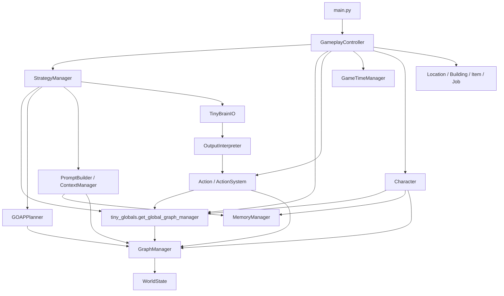

# Module Connectivity Map

This document complements the existing high-level and subsystem deep dives by
focusing on how the core runtime files, classes, and functions connect in the
current codebase.

It is intentionally grounded in the implementation rather than the conceptual
architecture. Use it alongside:

- `design_docs/high_level_architecture.md` for the broad subsystem picture
- `design_docs/data_flow_decision_cycle.md` for the conceptual sequence view
- `design_docs/graph_manager_deep_dive.md` for the world-state internals
- `design_docs/action_system_deep_dive.md` and
  `design_docs/memory_manager_deep_dive.md` for subsystem details

## Entry Points and Top-Level Orchestration

The main runtime entry remains `main.py`.

- `run_visual_demo()` in `main.py:88` imports `GameplayController`, creates it
  with the parsed config, and calls `controller.run()`.
- `run_minimal_demo()` in `main.py:126` routes through
  `demo_minimal_integration.demonstrate_minimal_integration()`.
- `run_tests()` in `main.py:149` routes into `test_integration_minimal`.

For the full game loop, `tiny_gameplay_controller.py` is the real integration
hub:

- `GameplayController.__init__()` at `tiny_gameplay_controller.py:1712`
  initializes the recovery/checkpoint systems, then wires strategy, graph,
  storytelling, rendering, and map subsystems.
- `initialize_game_systems()` at `tiny_gameplay_controller.py:2153` imports and
  instantiates the action system, time system, and related gameplay services.
- `game_loop()` at `tiny_gameplay_controller.py:2775` drives frame updates.
- `update_game_state()` at `tiny_gameplay_controller.py:3382` is the per-tick
  coordinator for events, characters, time, buildings, and feature systems.

## Core Connectivity Diagram

## File, Class, and Function Relationship Map

| File | Primary symbols | Reads from | Updates and calls into | Why it matters |
| --- | --- | --- | --- | --- |
| `main.py` | `run_visual_demo()`, `run_minimal_demo()`, `run_tests()` | CLI args, config | `GameplayController`, demo/test entry points | Selects execution surface |
| `tiny_gameplay_controller.py` | `GameplayController`, `update_game_state()`, `_update_character()` | Strategy, events, graph, map, time, buildings | Character update pipeline, rendering, event/strategy integration | Central runtime orchestrator |
| `tiny_globals.py` | `get_global_graph_manager()` | global singleton state | `GraphManager()` creation | Cross-file service locator for world state |
| `tiny_graph_manager.py` | `GraphManager`, `get_character_state()`, `get_possible_actions()`, `calculate_goal_difficulty()` | `WorldState`, graph entities | `update_node_attribute()`, analytics, social model | Shared world-state authority |
| `tiny_characters.py` | `Character`, `Goal`, motives and trait classes | Global graph manager, actions, time, inventory | Character-local state and graph-backed behavior | Main agent/domain object |
| `actions.py` | `Action`, `ActionSystem`, specific action types | Preconditions, effects, graph manager | Python object state + `graph_manager.update_node_attribute()` | Execution layer and GOAP effect model |
| `tiny_strategy_manager.py` | `StrategyManager`, `get_daily_actions()`, `decide_action_with_llm()`, `plan_daily_activities()`, `update_strategy()` | Graph manager, GOAP, utility functions, optional LLM stack | GOAP planning, optional prompt/LLM/output pipeline | Decision orchestration layer |
| `tiny_goap_system.py` | `GOAPPlanner`, `Plan`, `ActionWrapper` | Character state, GraphManager world context, available actions | Action planning and plan evaluation | Search/planning engine |
| `tiny_prompt_builder.py` | `ContextManager`, `PromptBuilder.generate_daily_routine_prompt()` | Character state, environment, memories | Formatted prompt strings | Gathers and structures LLM context |
| `tiny_brain_io.py` | `TinyBrainIO`, `input_to_model()` | Prompt strings | LLM call | Model I/O boundary |
| `tiny_output_interpreter.py` | `StructuredLLMOutput`, `OutputInterpreter`, `interpret_response()` | Raw LLM output, candidate actions | Action instance resolution / fallback | Turns text back into executable behavior |
| `tiny_memories.py` | `MemoryManager`, `SpecificMemory`, `FlatMemoryAccess` | Character experiences and NLP/embedding inputs | Memory storage and retrieval | Historical context and retrieval |
| `tiny_time_manager.py` | `GameCalendar`, `GameTimeManager` | Current simulation time | Scheduled behavior checks | Simulation timing |
| `tiny_locations.py`, `tiny_buildings.py`, `tiny_items.py`, `tiny_jobs.py` | `Location`, `Building`, `ItemObject`, `Job` | Domain configuration | Registered into graph / consumed by controller and characters | World entities |

## End-to-End Runtime Trace

The most important execution path is the character update loop:

1. `main.py:88` calls `GameplayController(config=...)`.
2. `GameplayController.__init__()` (`tiny_gameplay_controller.py:1712`) creates
   or acquires major subsystems, including `StrategyManager` and the global
   `GraphManager`.
3. `initialize_game_systems()` (`tiny_gameplay_controller.py:2153`) creates the
   `ActionSystem`, calls `setup_actions()`, and creates an `ActionResolver`.
4. `update_game_state()` (`tiny_gameplay_controller.py:3382`) processes events
   and loops over `self.characters`.
5. `_update_character()` (`tiny_gameplay_controller.py:3600`) calls:
   - `_update_character_memory()`
   - `_update_character_goals()`
   - `_execute_character_actions()`
6. In the non-LLM path, `_execute_character_actions()` asks
   `StrategyManager.get_daily_actions()` (`tiny_strategy_manager.py:789`) for
   sorted actions and executes the top action if it exposes `execute()`.
7. `StrategyManager.get_daily_actions()` builds candidate actions, then scores
   them with `tiny_utility_functions.calculate_action_utility(...)`.
8. In GOAP-centric flows, `StrategyManager.plan_daily_activities()` at
   `tiny_strategy_manager.py:1865` calls
   `self.goap_planner.plan_actions(...)`.
9. `GOAPPlanner.get_current_world_state()` (`tiny_goap_system.py:598`) enriches
   character-local state with `GraphManager.get_character_state(...)`.
10. `Action.execute()` (`actions.py:740`) resolves targets, mutates Python
    objects, then propagates state to the shared world using
    `graph_manager.update_node_attribute(...)` (`actions.py:843-856`).

This means the controller owns cadence, the strategy manager owns action choice,
the GOAP system owns search, and the action layer is where simulated or chosen
changes become real graph updates.

## LLM Decision Pipeline Connectivity

The intended LLM path is distributed across three files plus the strategy layer:

1. `StrategyManager.decide_action_with_llm()` at
   `tiny_strategy_manager.py:932` is the highest-level orchestrator for LLM
   decisions.
2. It creates a `PromptBuilder` and derives action choices from
   `get_daily_actions()`.
3. `PromptBuilder.generate_daily_routine_prompt()` at
   `tiny_prompt_builder.py:2518` uses `ContextManager` helpers:
   - `gather_character_context()` (`tiny_prompt_builder.py:40`)
   - `gather_environmental_context()` (`78`)
   - `gather_memory_context()` (`95`)
4. `TinyBrainIO.input_to_model()` (`tiny_brain_io.py:138`) submits the prompt.
5. `OutputInterpreter.interpret_response()` at
   `tiny_output_interpreter.py:405` parses text into `StructuredLLMOutput`,
   tries to match one of the offered actions first, then falls back to the
   interpreter's broader `action_class_map`.

One implementation nuance is important for contributors: the controller's
`process_character_turn()` (`tiny_gameplay_controller.py:3869`) initializes the
same LLM-related components, gathers potential actions, and currently returns
`_execute_fallback_character_action(character)` instead of completing the full
prompt → model → interpreter → execute loop. The strategy-layer LLM pipeline is
therefore more complete than the controller's direct LLM turn path.

## Shared State and Synchronization Points

The main cross-file synchronization mechanism is the global graph manager.

- `tiny_globals.get_global_graph_manager()` (`tiny_globals.py:212`) lazily
  creates a singleton `GraphManager`.
- `Character.__init__()` (`tiny_characters.py:2099`) falls back to that global
  instance when one is not injected; the `GraphManager` fallback logic is
  currently around `tiny_characters.py:2149`.
- `StrategyManager.__init__()` (`tiny_strategy_manager.py:122`) does the same.
- `Action.__init__()` (`actions.py:303`) also falls back to the global graph
  manager when no instance is passed.

Inside `GraphManager.__init__()` (`tiny_graph_manager.py:723`), the manager
delegates its entity dictionaries to `WorldState`:

- `self.characters = self.world_state.characters`
- `self.locations = self.world_state.locations`
- `self.objects = self.world_state.objects`
- `self.jobs = self.world_state.jobs`
- `self.G = self.world_state.graph`

That delegation matters because most high-level systems act as though they are
mutating `GraphManager`, while the actual backing data lives in `world_state.py`.

## Current Documentation vs. Current Code

| Document | Current value | Gap or caveat |
| --- | --- | --- |
| `design_docs/high_level_architecture.md` | Good conceptual overview of the main subsystems | Conceptual names such as `MainApplication` and `LLM_Interface` are helpful, but they abstract away the concrete controller and function boundaries |
| `design_docs/data_flow_decision_cycle.md` | Good conceptual sequence for event → planning → action → memory | It does not highlight current line-level integration points or the controller's partial direct-LLM fallback behavior |
| `design_docs/strategy_management_architecture.md` | Useful historical analysis of strategy/GOAP responsibilities | It predates the current `update_strategy(events, subject="Emma")` shape and does not reflect the more detailed event-type routing and LLM gating |
| `docs/README.md` | Accurate index of current doc locations | It lacked a dedicated entry for a file/function/class connectivity map before this document |
| `README.md` | Good top-level orientation and run commands | Module list is broad; it does not show how the files collaborate during a real update cycle |

## Practical Contributor Routing

When changing behavior, start from the layer that owns the responsibility:

- **Change game-loop cadence or subsystem order**:
  `tiny_gameplay_controller.py`
- **Change world-state queries, registration, or graph updates**:
  `tiny_graph_manager.py` and `world_state.py`
- **Add or modify executable actions**:
  `actions.py`, then confirm `tiny_strategy_manager.py` surfaces the action and
  `tiny_output_interpreter.py` can map any LLM-requested name to it
- **Change planning heuristics**:
  `tiny_strategy_manager.py`, `tiny_goap_system.py`, and
  `tiny_utility_functions.py`
- **Change prompt/context or LLM parsing**:
  `tiny_prompt_builder.py`, `tiny_brain_io.py`, and
  `tiny_output_interpreter.py`
- **Change memory-informed decisions**:
  `tiny_memories.py` plus the prompt builder's memory-context assembly

## Summary

Tiny Village is not just a collection of subsystem files; it is a layered
runtime with a clear coordination pattern:

- `main.py` selects the operating mode
- `GameplayController` owns startup and frame cadence
- `GraphManager`/`WorldState` hold shared simulation truth
- `StrategyManager` and `GOAPPlanner` choose what to do
- `Action` objects execute and persist world-state changes
- prompt/brain/interpreter modules provide optional text-driven decisions
- memory, time, and domain entity modules enrich the same shared loop

If you need one document that explains how the files, classes, and functions are
actually connected today, start here, then drill down into the existing
subsystem deep dives.
