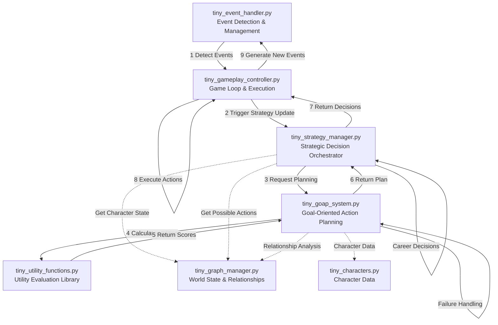
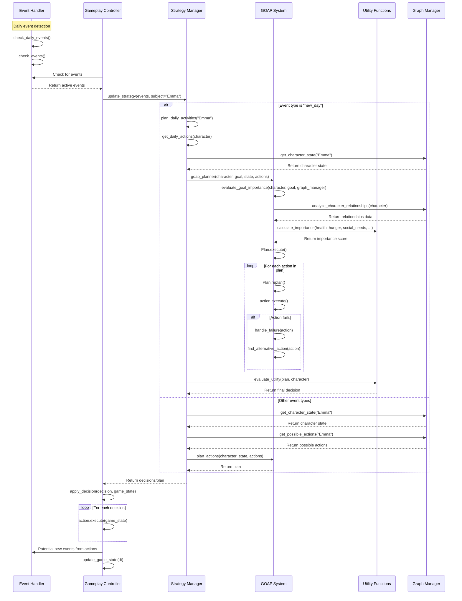
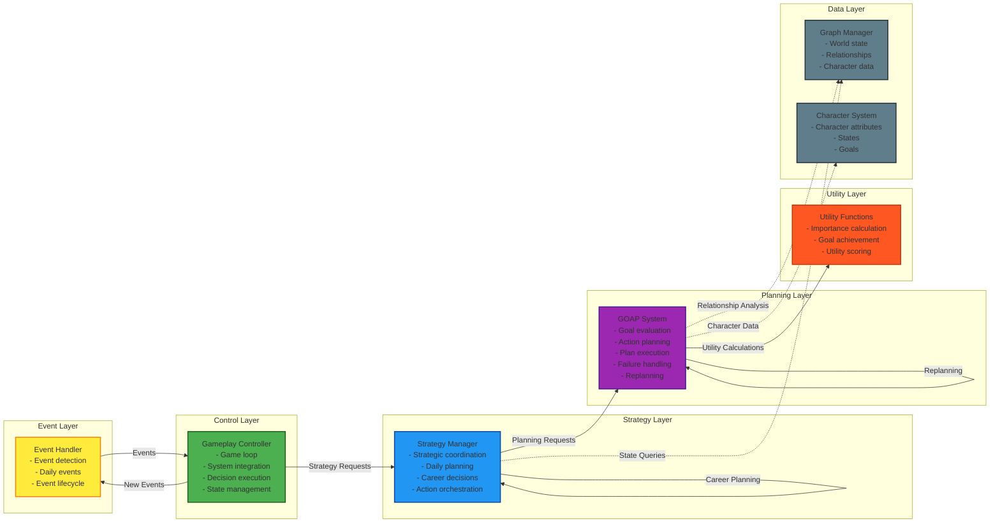

# Tiny Village System Architecture Analysis

*Generated on 2025-05-29 20:38:40 UTC by dhar174*

This document provides a comprehensive analysis of the five core scripts in the Tiny Village system and their interactions, complete with Mermaid diagrams illustrating the workflow and architectural relationships.

## Individual Script Analysis

### 1. **tiny_strategy_manager.py** - Strategic Decision Orchestrator
**Purpose**: Acts as the central orchestrator for character decision-making and strategy formulation.

**Key Components**:
- `StrategyManager` class - Main coordination hub
- **Dependencies**: 
  - `GOAPPlanner` from tiny_goap_system
  - `GraphManager` from tiny_graph_manager  
  - `evaluate_utility` from tiny_utility_functions

**Core Functions**:
- `update_strategy(events, subject)` - Main entry point for strategy updates
- `plan_daily_activities(character)` - Creates daily action plans
- `respond_to_job_offer()` - Handles career decisions
- Helper methods for getting action sets (`get_daily_actions`, `get_career_actions`)

**Architecture Role**: **High-level coordinator** that receives events and orchestrates the planning process using other systems.

---

### 2. **tiny_goap_system.py** - Goal-Oriented Action Planning Engine
**Purpose**: Implements sophisticated Goal-Oriented Action Planning (GOAP) with utility evaluation and plan execution.

**Key Components**:
- `Plan` class - Represents executable action sequences with priority queues
- `GOAPPlanner` class - Core planning algorithms and goal evaluation

**Core Functions**:
- `Plan.execute()` - Executes action sequences with failure handling
- `Plan.replan()` - Dynamically adjusts plans based on changing conditions
- `GOAPPlanner.evaluate_goal_importance()` - Complex goal prioritization using character state, relationships, and environmental factors
- `calculate_utility()` - Evaluates action utility considering multiple factors
- Specialized goal importance calculators for different goal types (Basic Needs, Social, Career, etc.)

**Architecture Role**: **Core AI engine** that transforms high-level goals into executable action sequences.

---

### 3. **tiny_event_handler.py** - Event Detection and Management
**Purpose**: Manages game events and triggers strategic responses.

**Key Components**:
- `Event` class - Represents game events with metadata
- `EventHandler` class - Manages event lifecycle and detection

**Core Functions**:
- `add_event(event)` - Registers events and updates graph
- `check_events()` - Detects active events based on current date
- `check_daily_events()` - Specifically handles new day events

**Architecture Role**: **Event trigger system** that detects changes and initiates strategic planning cycles.

---

### 4. **tiny_gameplay_controller.py** - Game Loop and Execution Engine
**Purpose**: Main game controller that integrates all systems and manages the game loop.

**Key Components**:
- `GameplayController` class - Central game management
- Pygame-based rendering and interaction system
- Character and world state management

**Core Functions**:
- `game_loop()` - Main execution loop
- `update_game_state(dt)` - Updates all systems per frame
- `initialize_game_systems()` - Sets up all game components
- `_create_sample_characters()` - Creates initial game population
- `apply_decision(decision, game_state)` - Executes strategic decisions

**Architecture Role**: **System integrator and executor** that ties everything together and manages real-time execution.

---

### 5. **tiny_utility_functions.py** - Utility Evaluation Library
**Purpose**: Provides utility calculation and goal evaluation functions.

**Key Components**:
- Standalone utility functions for importance calculation
- Goal achievement checking functions
- State evaluation utilities

**Core Functions**:
- `calculate_importance()` - Multi-factor importance scoring
- `evaluate_goal_importance()` - Goal prioritization based on character state
- `is_goal_achieved()` - Goal completion validation

**Architecture Role**: **Mathematical foundation** providing the quantitative basis for decision-making.

---

## System Interaction Diagrams

### High-Level Component Interactions



### Detailed Sequence Diagram



### Architectural Layers Diagram



## Workflow Analysis

### Primary Workflow Sequence

1. **EVENT DETECTION & TRIGGERING**
   - `tiny_event_handler.py` → `tiny_gameplay_controller.py`
   
2. **STRATEGIC PLANNING INITIATION**  
   - `tiny_gameplay_controller.py` → `tiny_strategy_manager.py`
   
3. **GOAL-ORIENTED PLANNING**
   - `tiny_strategy_manager.py` → `tiny_goap_system.py`
   
4. **UTILITY EVALUATION**
   - `tiny_goap_system.py` → `tiny_utility_functions.py`
   
5. **DECISION EXECUTION**
   - `tiny_strategy_manager.py` → `tiny_gameplay_controller.py`

### Detailed Interaction Workflow

#### **Phase 1: Event Detection and Response Triggering**
1. **tiny_event_handler.py** detects events (new day, special events)
2. **tiny_gameplay_controller.py** receives events through `event_handler.check_events()`
3. Controller calls `strategy_manager.update_strategy(events)` to initiate planning

#### **Phase 2: Strategic Analysis and Goal Setting**
4. **tiny_strategy_manager.py** processes events in `update_strategy()`
5. For "new_day" events → calls `plan_daily_activities()`
6. Strategy Manager requests character state from `graph_manager.get_character_state()`
7. Gets possible actions via `graph_manager.get_possible_actions()`

#### **Phase 3: GOAP Planning and Optimization**
8. **tiny_strategy_manager.py** invokes `goap_planner.plan_actions(state, actions)`
9. **tiny_goap_system.py** creates a `Plan` object with goals and actions
10. `GOAPPlanner.evaluate_goal_importance()` analyzes goal priority using character relationships, needs, and environmental factors
11. Planning algorithm searches action space to find optimal sequences

#### **Phase 4: Utility Evaluation and Decision Making**
12. **tiny_goap_system.py** calls **tiny_utility_functions.py** functions:
    - `calculate_importance()` for goal prioritization
    - `evaluate_goal_importance()` for context-aware scoring
13. **tiny_strategy_manager.py** calls `evaluate_utility(plan, character)` to select best actions
14. Returns final decision to controller

#### **Phase 5: Execution and State Updates**
15. **tiny_gameplay_controller.py** receives decisions in `update(game_state)`
16. Calls `apply_decision(decision, game_state)` for each action
17. Actions execute and update character/world state
18. **tiny_event_handler.py** may generate new events based on action outcomes
19. Cycle repeats

### Cross-Cutting Interactions

**Graph Manager Integration** (Referenced but not analyzed):
- All systems interact with `tiny_graph_manager` for relationship and world state data
- Provides context for goal evaluation and action planning

**Character State Management**:
- Character state flows from gameplay_controller → strategy_manager → goap_system
- Updated state flows back through the chain after execution

**Error Handling and Adaptation**:
- `Plan.handle_failure()` in goap_system triggers replanning
- `Plan.find_alternative_action()` creates backup strategies
- System maintains robustness through adaptive replanning

### Data Flow Summary
```
Events → Strategic Decisions → GOAP Plans → Utility Scores → Executed Actions → Updated State → New Events
```

## Key Architectural Insights

The diagrams reveal several important architectural patterns:

1. **Event-Driven Architecture**: Events trigger the entire planning cycle, enabling reactive and proactive behavior
2. **Layered Design**: Clear separation between event detection, control, strategy, planning, and utility layers
3. **Feedback Loops**: Actions create new events, maintaining dynamic simulation state
4. **Dependency Injection**: Graph Manager and Character systems provide context data without tight coupling
5. **Adaptive Planning**: GOAP system can replan and handle failures dynamically
6. **Utility-Based Decisions**: All decisions are grounded in quantitative utility calculations

This architecture enables emergent behavior through the interaction of these relatively simple systems, creating a sophisticated AI simulation for the tiny village where:

- **Events** trigger **strategic thinking**
- **Strategic thinking** uses **goal-oriented planning** 
- **Planning** leverages **utility evaluation**
- **Decisions** drive **game execution**
- **Execution** creates **new events**

The system forms a complete feedback loop enabling emergent, adaptive behavior in the tiny village simulation.

---

*This analysis was generated through comprehensive script examination and interaction mapping to provide a complete understanding of the Tiny Village system architecture.*
